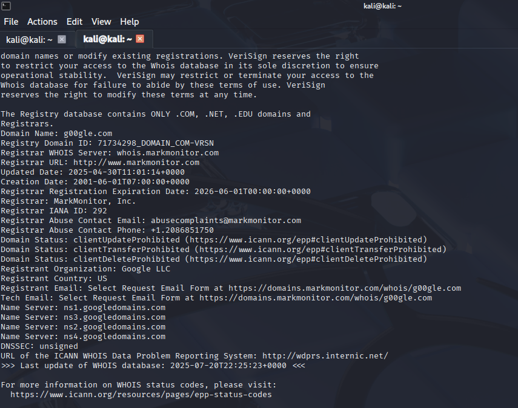

# Analyzing a Malicious URL with urlcrazy

In this lab, I used urlcrazy on Kali Linux to simulate phishing style domains based on `google.com`. I walked through how a SOC analyst might identify, investigate, and document a suspicious domain like `g00gle.com` using open-source tools. The lab includes screenshots, a code patch I had to make, and a full investigation summary.

---

## 🔧 Tools Used

- Kali Linux
- urlcrazy
- WHOIS
- VirusTotal

---

## 🪛 Step 0: Install and Patch urlcrazy

When I first tried running `urlcrazy`, it threw a `NoMethodError` due to a deprecated Ruby method (`File.exists?`). I fixed it by editing the tool’s source code at `/usr/share/urlcrazy/country.rb`, replacing:

```ruby
File.exists?(country_db)
```

with:

```ruby
File.exist?(country_db)
```

This change aligns with [Ruby’s updated documentation](https://ruby-doc.org/core/File.html#method-c-exist-3F), where `File.exists?` has been deprecated in favor of `File.exist?`.

This allowed the tool to run properly.

📸 

---

## 📖 Step 1: Understand the Tool

I started by reading the help menu to see what urlcrazy could do.

```bash
urlcrazy --help
```

📸 

---

## 🔍 Step 2: Generate Lookalike Domains

I ran a simulation on `google.com` to generate a list of typo-squatted domains and checked which ones were registered.

```bash
urlcrazy google.com
```

📸 

---

## 🧪 Step 3: Investigate a Suspicious Domain

I chose to investigate `g00gle.com`, which looked suspicious due to the use of the number zero in place of the letter “o.”

### 🔎 VirusTotal Scan

- 0/97 vendors flagged it as malicious
- Contained trackers, redirects, and third-party resources
- Community score was -31, likely due to visual trickery

📸 

### 🔎 WHOIS Lookup

I confirmed `g00gle.com` is actually owned by **Google LLC** and registered through **MarkMonitor**, a well known corporate registrar.

📸 

---

## 🧾 Step 4: Documentation Summary

I documented the full investigation process in plain language to mimic what a SOC analyst would report in a real world case.

- **Suspicious Domain Investigated**: g00gle.com
- **Typo Type**: Homoglyph (uses the number “0” instead of the letter “o”)
- **Tools Used**:
  - urlcrazy to generate and identify lookalike domains


  - whois for domain ownership lookup


  - VirusTotal for threat reputation analysis


- **Findings**:
  - Domain is registered through MarkMonitor Inc., a registrar used by Google


  - WHOIS confirms the Registrant Organization is Google LLC


  - Name servers point to ns1–ns4.googledomains.com
  - VirusTotal scan shows 0/97 detection with standard HTML content and no malicious behavior


- **Conclusion**:
The domain g00gle.com is benign. Despite looking suspicious at first glance, it is legitimately owned by Google. This is likely part of a defensive domain registration strategy used to prevent phishing or brand impersonation.


---

## 🧠 Key Takeaways

- Some typo-squatted domains are actually owned by the original company
- WHOIS + VirusTotal are a powerful combo for fast triage
- Code patching and error handling are important skills in a SOC or lab setting
- Documentation matters even when the result is “not a threat”

